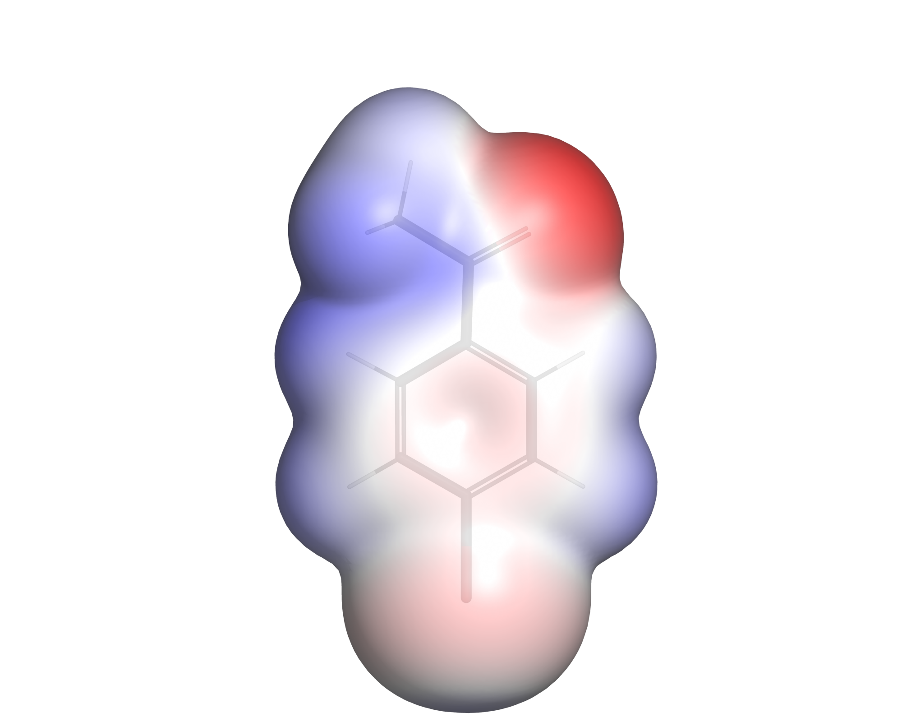
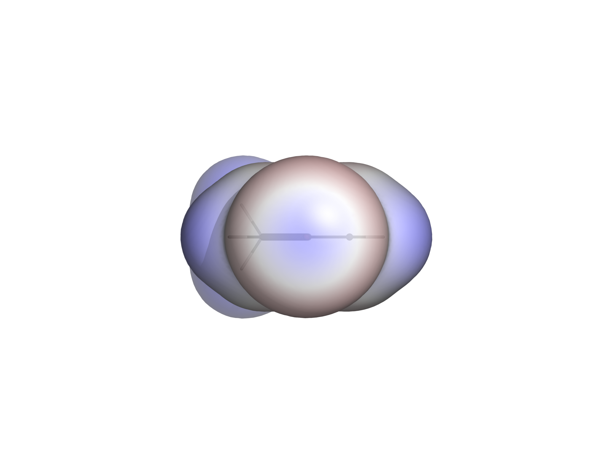
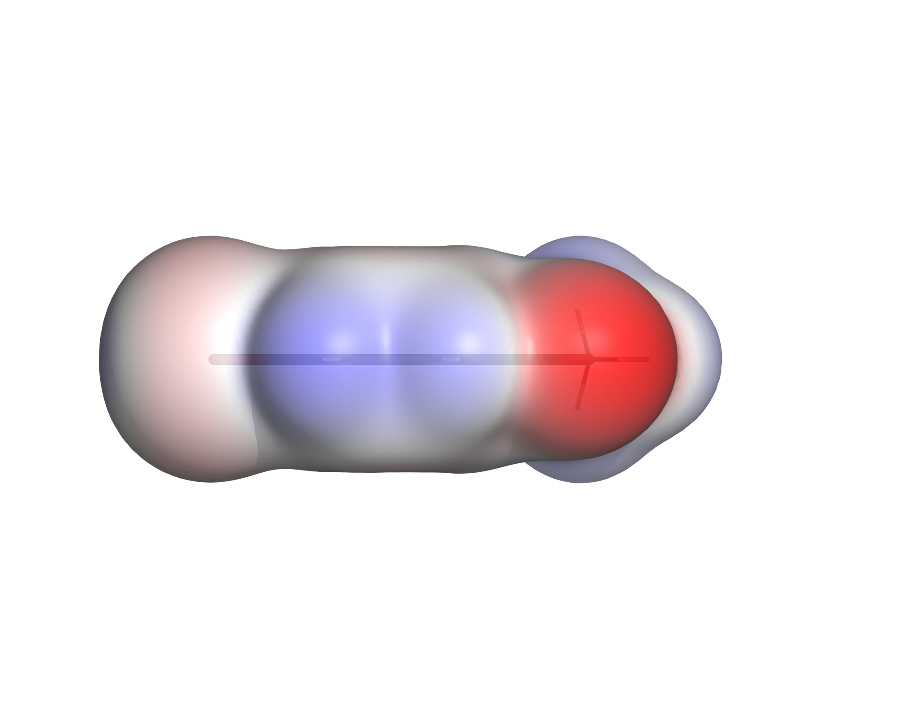
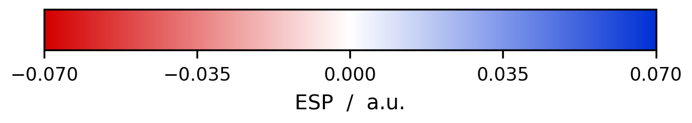

# ESP Visualization

**User Guide — How to Run the ESP Visualization Workflow**

A reproducible, scriptable workflow that turns Turbomole `pointval` output into
publication-quality images of the molecular electrostatic potential (ESP) mapped
onto an electron-density isosurface.

| | |
|---|---|
| Input | Turbomole `pointval` grids (`td.xyz`, `tp.xyz`) + a structure file |
| Output | Gaussian cube files, a standard set of PNG images, a CSV of surface ESP statistics & a PyMOL Script to visualize the ESP in Pymol|
| Software | Python 3 + NumPy + PyMOL (open source), all free |
| Manual steps | none — the whole pipeline is two commands |

<p align="center">
  
  
  
</p>
<p align="center">
  
</p>

<p align="center"><em>4-Bromoacetophenone: π face, view along the C–Br axis
(σ-hole), in-plane profile, and the colour scale that belongs to them.</em></p>

> **This document is the operating manual only** — installation, execution,
> every parameter, example commands. The background it used to carry (why the
> ρ = 0.001 surface, which number describes the σ-hole, the parameter study, the
> measured results and the references) is in
> **[`docs/ESP_Visualization_Background.docx`](docs/ESP_Visualization_Background.docx)**.
> Read that document before interpreting any number this workflow produces.

---

## Contents

1. [Installation](#1-installation)
2. [Input files and formats](#2-input-files-and-formats)
3. [Quick start](#3-quick-start)
4. [Step 1 — Convert the grids to cube (`xyzToCube.py`)](#4-step-1--convert-the-grids-to-cube-xyztocubepy)
5. [Step 2 — Look at it interactively (`esp.pml`)](#5-step-2--look-at-it-interactively-esppml)
6. [Step 3 — Render the standard image set (`render_esp.py`)](#6-step-3--render-the-standard-image-set-render_esppy)
7. [Step 4 — Several molecules at once (`run_all.py`)](#7-step-4--several-molecules-at-once-run_allpy)
8. [What the workflow writes](#8-what-the-workflow-writes)
9. [Console output and colours](#9-console-output-and-colours)
10. [Create Tp.xyz, Td.xyz and a structure file from a SMILES notation](#10-create-tp.xyz,-td.xyz,-and-a-structure-file-from-a-smiles-notation)
11. [Repository layout](#11-repository-layout)
12. [Troubleshooting](#12-troubleshooting)

---

## 1. Installation

### 1.1 Prerequisite: a working conda

This workflow needs a **functioning conda installation**.

If you have no conda yet, install
**[Miniforge](https://conda-forge.org/download/)** — it is free, defaults to the
conda-forge channel that this workflow uses, and is small. During installation:

| Option | Setting |
|---|---|
| Create shortcuts | **yes** — this gives you the "Miniforge Prompt" in the Start menu |
| Add to PATH | **no** — the installer is right, it causes conflicts |
| Register as default Python | **no** — leave any existing Python installation alone |
| Clear package cache | yes |

> **Do not rely on a conda that came bundled with another program.** Several
> chemistry packages (Schrödinger PyMOL among them) ship their own conda inside
> their installation folder. It may be incomplete or broken, it is not intended
> to be used as a general package manager, and — worse — VS Code will happily
> discover it and remember it as "the" conda of the system. You then get
> `conda.exe is not a valid application for this operating system platform` on
> every activation, no matter which interpreter you select. See
> [Troubleshooting](#11-troubleshooting) for how to get out of that.

Verify that conda works *before* going further:

```bash
conda --version
```

On Windows, use the **Miniforge Prompt** from the Start menu. To make conda
available in PowerShell as well, run once:

```bash
conda init powershell
```

then close and reopen every shell.

### 1.2 Create the environment

Keeping it separate from `base` means it can be recreated exactly and nothing
else on the machine is disturbed.

```bash
conda env create -f environment.yml
conda activate esp
```

| Packages inside the env | Needed for |
|---|---|
| `numpy` | everything — grid handling in all three scripts |
| `pymol-open-source` | rendering the images and the interactive scene |
| `matplotlib` | the separate `*_colorbar.png` only |


### 1.3 Verify & Smoketest

```bash
python -c "import pymol, numpy, matplotlib; print('ok')"
```

The smoke test is run with the following command:
```bash
cd scripts
python run_all.py
```
Running the (run_all.py) script without parameters results in the script using the `/reference/4-bromacetophenon` directory. It converts, renders and saves the images to: `reference/4-bromacetophenon/images_check/` and concludes a summary in the `reference/summary_check.csv`.
The summary and images can now be compared with the initial downloaded images and the script. When the results are the same 
Expected for 4-bromoacetophenone: V<sub>S,min</sub> = −0.0638 a.u. on O3, V<sub>S,max</sub> = +0.0469 a.u. on H14, σ-hole = +0.0221 a.u., colour range ±0.065 a.u. If those come out, the installation is fine.

---

## 2. Input files and formats

Per molecule, in one folder:

| File | Content | Units |
|---|---|---|
| `td.xyz` | Turbomole `pointval` **total density** grid | Bohr |
| `tp.xyz` | Turbomole `pointval` **total potential** (ESP) grid | Bohr |
| `*.mol` / `*.sdf` / `*.xyz` | molecular structure | Å (default) |

**`td.xyz` and `tp.xyz` are not structure files** despite the extension. They are
ASCII point clouds — one line per grid point, carrying the full coordinates plus
the value:

```
#grid1  start  -15.000000  delta    0.120000  points    251
#electrostatic potential
# cartesian coordinates x,y,z and f(x,y,z)
      -15.00000000   -15.00000000   -15.00000000   -0.00054019
```

At 251³ points that is about 1.25 GB per file. The same information as a
Gaussian cube is roughly 200 MB, because the cube format stores the grid
implicitly.

### Accepted structure formats

Both `xyzToCube.py` and `render_esp.py` accept the same three formats:

| Format | Notes |
|---|---|
| `.xyz` | `Symbol x y z`. With or without the leading atom-count and comment lines — a bare coordinate list is accepted. Unit set by `--struct-unit` (default Å). |
| `.mol` | MDL molfile, V2000 and V3000. **Coordinates come *before* the element symbol**, the reverse of xyz. Always Å. |
| `.sdf` | SD-file; only the first record (up to `$$$$`) is read. Always Å. |

`--struct-unit` applies to `.xyz` only. Molfile coordinates are in Ångström by
definition, so the option is ignored for them.

**Prefer `.mol`/`.sdf` over `.xyz`**: they carry bond information, so PyMOL draws
proper sticks instead of guessing connectivity from distances.

**Give both scripts the same structure file.** `xyzToCube.py` writes the atom
positions into the cube header, `render_esp.py` hands the structure to PyMOL for
the stick model. If you feed them two different files and those files ever
disagree — a different conformer, a different atom order — the skeleton will sit
offset from its own surface, and **nothing will warn you**. One file for both
removes the failure mode entirely.

---

## 3. Quick start

Everything is run from `scripts/`, with the `esp` environment active.

**One molecule, from raw grids to images:**

```bash
cd scripts
python xyzToCube.py --struct ../sandbox/brombenzol/brombenzol_aro_opti.mol \
                    ../sandbox/brombenzol/td.xyz ../sandbox/brombenzol/tp.xyz --pymol
python render_esp.py --density ../sandbox/brombenzol/td.cube \
                     --esp ../sandbox/brombenzol/tp.cube \
                     --struct ../sandbox/brombenzol/brombenzol_aro_opti.mol \
                     --prefix brombenzol --outdir ../sandbox/brombenzol/images
```

**A whole folder of molecules, in one command** — this is the normal way to use
the workflow:

```bash
cd scripts
python run_all.py --root ../sandbox --two-pass
```

---

## 4. Step 1 — Convert the grids to cube (`xyzToCube.py`)

```bash
cd scripts
python xyzToCube.py --struct ../path/to/molecule.mol ../path/to/td.xyz ../path/to/tp.xyz --pymol
```

Writes `td.cube`, `tp.cube` and — with `--pymol` — a ready-to-use `esp.pml` next
to the input files. Which grid is density and which is potential is detected from
the file header, not from the file name.

### Positional argument

| Argument | Meaning |
|---|---|
| `grids` | one or more Turbomole `pointval` files, e.g. `td.xyz tp.xyz`. Any number can be given; each produces one `.cube` next to it (or in `--outdir`). |

### Options that change the **cube files**

| Option | Default | Effect |
|---|---|---|
| `--struct`, `-s` | *required* | structure file, `.xyz` / `.mol` / `.sdf`. Its atoms go into the cube header. |
| `--struct-unit {angstrom,bohr}` | `angstrom` | unit of the structure file. Applies to `.xyz` only — `.mol`/`.sdf` are Å by definition and the option is ignored for them. |
| `--outdir`, `-o` | next to the input | write the cube files (and `esp.pml`) somewhere else. |
| `--stride N` | `1` | keep every N-th grid point per axis. `2` → **8× smaller** files. |
| `--quiet`, `-q` | off | suppress progress output. |

### Options that change only the generated `esp.pml`

They do nothing without `--pymol`, which is why `--help` lists them in their own
group.

| Option | Default | Effect |
|---|---|---|
| `--pymol` | off | write the PyMOL scene at all. |
| `--esp-range` | `auto` | half-width of the colour scale in a.u., or `auto` — derived from the ESP on the isosurface, exactly as `render_esp.py` does it. |
| `--pml-iso` | `0.001` | isovalue **drawn in the scene**. Deliberately named apart from `render_esp.py`'s `--iso`: that one moves the measured numbers, this one only the picture. |
| `--transparency` | `0.15` | surface transparency, 0…1. `0` = opaque. |
| `--rainbow` | off | rainbow ramp in the scene instead of red–white–blue; writes `esp_rainbow.pml` so the standard scene survives. |

### Examples

```bash
# standard: cubes + interactive scene
python xyzToCube.py --struct mol.mol td.xyz tp.xyz --pymol

# fast pass: 8x smaller cubes, images look identical
python xyzToCube.py --struct mol.mol td.xyz tp.xyz --stride 2 --pymol

# structure file already in Bohr, cubes into a separate folder
python xyzToCube.py --struct mol.xyz --struct-unit bohr --outdir ../out td.xyz tp.xyz

# fixed colour scale and an opaque surface in the scene
python xyzToCube.py --struct mol.mol td.xyz tp.xyz --pymol \
                    --esp-range 0.035 --transparency 0
```

**On `--stride`.** Use `--stride 2` while exploring and for images; use full
resolution whenever a σ-hole value goes into a table. The measurements behind
that rule are in the background document, §"Parameter study".

What the converter takes care of, which is where hand-rolled conversions usually
go wrong:

* **Index order.** Turbomole varies *x* fastest, the cube format varies *z*
  fastest. Without reordering you get a transposed, mirrored molecule.
* **Units.** The grid is in Bohr, the structure file is normally in Å (factor
  1.8897). Get this wrong and the molecule floats outside its own surface.

---

## 5. Step 2 — Look at it interactively (`esp.pml`)

Before rendering anything, check that structure and grids actually line up:

```bash
pymol esp.pml
```

or, inside a running PyMOL:

```
cd /path/to/molecule
@esp.pml
```

The script loads the structure and both cubes, builds the ρ = 0.001 isosurface,
maps the ESP onto it and shows the colour ramp. Rotate it. The molecular skeleton
should sit inside its surface, not next to it.

Handy while exploring:

```
turn x, 90              # tip into the ring plane
set transparency, 0     # opaque, strongest colours
set transparency, 0.15  # skeleton shows through (default)
disable espramp         # hide the colour bar
```

`esp.pml` always carries the colour scale that was actually used for that
molecule's images, so what you see interactively matches the figure set.

---

## 6. Step 3 — Render the standard image set (`render_esp.py`)

```bash
cd scripts
python render_esp.py --density ../path/td.cube --esp ../path/tp.cube \
                     --struct ../path/molecule.mol --prefix molecule
```

With no arguments it looks for `td.cube`, `tp.cube` and a structure file in the
current directory. Output goes to `images/`.

Three views are produced, oriented **from the molecular geometry**, not from
PyMOL's `orient`:

| File | View | Shows |
|---|---|---|
| `*_pi.png` | perpendicular to the molecular plane | π system, ring hydrogens |
| `*_sigma.png` | along the C–halogen axis, from outside | **the σ-hole, head on** |
| `*_edge.png` | in the molecular plane | overall profile |

Every molecule therefore lands in the same orientation automatically — that is
what makes an image set comparable, and it is why no manual rotation is needed or
wanted. For molecules without a halogen, `*_sigma.png` looks down the longest
principal axis instead; read the file name as "axial view" in that case.

### Options

| Option | Default | Effect |
|---|---|---|
| `--density` | autodetect `td.cube` in the working directory | cube file of the electron density |
| `--esp` | autodetect `tp.cube` | cube file of the ESP |
| `--struct` | autodetect `*.mol` / `*.sdf` / `*.xyz` | structure file for the stick model |
| `--prefix` | folder name | prefix of every output file name |
| `--outdir` | `images` | output folder |
| `--iso` | `0.001` | density isovalue. **Changes the measured numbers**, not just the picture — see the background document before touching it. |
| `--esp-range` | `auto` | `auto`, or a fixed half-width in a.u. such as `0.035`. Visual only; no computed value depends on it. |
| `--transparency` | `0.15` | 0…1. `0` = opaque and strongest colours; above ~0.3 the profile views become unreadable. |
| `--backgrounds` | `white` | one or more background colours, e.g. `--backgrounds white black` renders each view twice. |
| `--views` | all three | subset of `pi`, `edge`, `sigma`, e.g. `--views pi sigma`. |
| `--width` | `2000` | image width in px |
| `--height` | `1600` | image height in px |
| `--dpi` | `300` | dpi written into the PNG |
| `--buffer` | `2.4` | margin around the molecule, Å |
| `--rainbow` | off | rainbow ramp; writes a separate `<prefix>_rainbow_*` set, so the standard set survives. |
| `--no-color` | off | plain console output without ANSI colours. |

### Examples

```bash
# everything autodetected in the current molecule folder
cd ../sandbox/brombenzol && python ../../scripts/render_esp.py

# explicit, with a fixed comparable colour scale
python render_esp.py --density td.cube --esp tp.cube --struct mol.mol \
                     --prefix brombenzol --esp-range 0.035

# only the sigma view, opaque, on both backgrounds
python render_esp.py --views sigma --transparency 0 --backgrounds white black

# larger figure for a poster
python render_esp.py --width 4000 --height 3200 --dpi 600

# second image set with the rainbow ramp, standard set kept
python render_esp.py --rainbow
```

**Do not use the PyMOL launcher unless you have to.** `python render_esp.py …`
loads no `pymolrc`, so nobody's personal start-up file can silently change a
setting. If you do use the launcher, both the `--` separator and `-k` are
required:

```bash
pymol -ckq render_esp.py -- --prefix molecule
```

---

## 7. Step 4 — Several molecules at once (`run_all.py`)

Put each molecule in its own folder under a common root — for your own data that
is `sandbox/`, which git ignores:

```
sandbox/
├── bromobenzene/   td.xyz  tp.xyz  bromobenzene.mol
├── iodobenzene/    td.xyz  tp.xyz  iodobenzene.mol
└── chlorobenzene/  td.xyz  tp.xyz  chlorobenzene.mol
```

Then:

```bash
cd scripts
python run_all.py --root ../sandbox --two-pass
```

This converts what needs converting, renders every molecule, writes an `esp.pml`
next to each molecule's cube files, and collects `summary.csv`. Called **without
arguments** it runs on `reference/` instead — the smoke test from §1.3.

### Options

| Option | Default | Effect |
|---|---|---|
| `--root` | `reference/` | directory tree to search for molecule folders |
| `--only NAME …` | all | restrict the run to these folders; simple wildcards allowed, e.g. `--only paracetamol '*benzol'` |
| `--stride N` | `1` (full resolution) | grid decimation **during conversion**. Ignored when the cube files already exist — use `--force-convert` to rebuild them. |
| `--struct-unit {angstrom,bohr}` | `angstrom` | as in `xyzToCube.py`; `.xyz` only |
| `--force-convert` | off | rewrite cube files even if they already exist |
| `--esp-range` | `auto` | `auto` (per molecule) or a fixed value in a.u. for all of them |
| `--two-pass` | off | render with `auto` first, then re-render everything with the largest range found — the recommended mode for a figure set |
| `--rainbow` | off | rainbow ramp; writes a separate `<molecule>_rainbow_*` set and `esp_rainbow.pml` |
| `--iso` | `0.001` | density isovalue, passed through to `render_esp.py` |
| `--transparency` | `0.15` | passed through |
| `--backgrounds` | `white` | passed through |
| `--width` | `2000` | passed through |
| `--height` | `1600` | passed through |
| `--dpi` | `300` | passed through |
| `--buffer` | `2.4` | passed through |
| `--images-dir` | `images` (`images_check` for the built-in reference run) | name of the output folder inside each molecule folder |
| `--summary` | `<root>/summary.csv` | path of the CSV summary |
| `--no-color` | off | plain console output without ANSI colours |

### Examples

```bash
# the normal run: one comparable colour scale for the whole set
python run_all.py --root ../sandbox --two-pass

# faster first pass, 8x smaller cubes
python run_all.py --root ../sandbox --two-pass --stride 2

# pick individual molecules out of a larger root
python run_all.py --root ../sandbox --only paracetamol chlormethan --two-pass
python run_all.py --root ../sandbox --only "*benzol"

# rebuild cube files that already exist, at full resolution
python run_all.py --root ../sandbox --force-convert

# re-render a few molecules with the current script version
python run_all.py --root ../sandbox --only chlorbenzol chlormethan iodbenzol

# fixed scale for everything, summary elsewhere
python run_all.py --root ../sandbox --esp-range 0.035 --summary ../results/summary.csv

# installation check on the reference data
python run_all.py
```

> **Do not put a common colour scale across data of different provenance.**
> `--two-pass` gives every molecule in the run the same scale, which is only
> meaningful if they were computed the same way — same geometry optimisation,
> same method, same basis set. Use `--only` or separate root folders to keep
> groups apart, and run `--two-pass` within each group.

---

## 8. What the workflow writes

Per molecule folder:

| File | Written by | Content |
|---|---|---|
| `td.cube`, `tp.cube` | `xyzToCube.py` | density and ESP grids in Gaussian cube format |
| `esp.pml` | `xyzToCube.py --pymol`, `run_all.py` | interactive PyMOL scene with the scale actually used |
| `images/<prefix>_pi.png` | `render_esp.py` | π face |
| `images/<prefix>_sigma.png` | `render_esp.py` | along the C–X axis |
| `images/<prefix>_edge.png` | `render_esp.py` | in-plane profile |
| `images/<prefix>_colorbar.png` | `render_esp.py` | the colour scale as a separate figure (needs matplotlib) |
| `images/<prefix>_settings.txt` | `render_esp.py` | **every parameter used**, plus the measured surface ESP values. Keep it next to the figures — it is the record of how they were made. |

With `--rainbow` the same names appear with `_rainbow` inserted
(`<prefix>_rainbow_pi.png`, `esp_rainbow.pml`, …), so a rainbow run never
overwrites the standard set.

Per run, `run_all.py` writes `summary.csv`:

| Column | Content |
|---|---|
| `molecule` | folder name |
| `grid`, `spacing_bohr` | cube dimensions and grid spacing |
| `iso` | density isovalue used |
| `esp_range_au` | colour range used |
| `shell_points` | number of grid points on the ρ = iso shell |
| `VS_min_au`, `VS_max_au` | global surface ESP extrema, with the atoms they sit on |
| `sigma_hole_au` | the **strongest** σ-hole, so the column stays sortable |
| `sigma_hole_on` | which atom that σ-hole belongs to, e.g. `Br1` |
| `n_halogens` | how many halogens were evaluated |
| `sigma_holes_all` | every one of them as `label:value` pairs, e.g. `Br1:0.00862;Cl4:-0.00398` |
| `belt_min_au` | the halogen belt minimum |
| `sigma_method` | which method produced the σ-hole value (ray-based or point-based) |
| `colormap` | `redblue` or `rainbow` |

Whatever colour range you choose, **state it in the figure caption** and ship
`*_colorbar.png` with the figures. An ESP figure without its scale is
uninterpretable.

---

## 9. Console output and colours

`render_esp.py` and `run_all.py` print the measured values per molecule, with
molecule headers in green and halogen symbols in cyan so the relevant lines stand
out in a long batch run:

```
    V_S,max = +0.0312 a.u.  =  +19.6 kcal/(mol*e)   auf H5
  Lokal am Halogen (Br):
    sigma-Loch  = +0.0126 a.u.  =   +7.9 kcal/(mol*e)   [144 Punkte]
    Guertel     = -0.0188 a.u.  =  -11.8 kcal/(mol*e)   [836 Punkte]
    ! V_S,max liegt auf H5, nicht auf dem Halogen
```

Colours switch off automatically when the output is redirected to a file or
piped, so log files stay clean. To turn them off explicitly:

```bash
python run_all.py --root ../sandbox --no-color
```

The `NO_COLOR` / `FORCE_COLOR` environment variables are honoured as well (see
[no-color.org](https://no-color.org)). These are *environment variables*, not
arguments, so they are set before the command rather than appended to it:

```powershell
# PowerShell
$env:NO_COLOR = 1
python run_all.py --root ../sandbox
Remove-Item Env:NO_COLOR
```

```bash
# bash
NO_COLOR=1 python run_all.py --root ../sandbox
```

---

## 10. Create Tp.xyz, Td.xyz and a structure file from a SMILES notation

In order to create your own files to test the application with your own molecules, a script  is provided within the /tools folder:
`tools/CreateTpTdFromSmiles.py`.

Running this script needs a seperate environment — see `tools/environment-testdata.yml` and all infos about it can be found in the `tools/README.txt`.

## 11. Repository layout

```
esp_visualization/
├── README.md                     this document (the user guide)
├── environment.yml               conda environment
├── .gitignore
├── scripts/
│   ├── xyzToCube.py              Turbomole pointval -> Gaussian cube
│   ├── render_esp.py             standard image set from cube files
│   ├── run_all.py                batch driver + summary.csv
│   ├── constants.py              unit conversions, shared by all scripts
│   └── ansi.py                   console colours (no dependencies)
├── reference/                    known-good example — output, not input
│   ├── summary.csv
│   └── 4-bromacetophenon/
│       ├── 4-bromacetophenon.mol
│       ├── td.xyz                raw pointval grids, decimated to 0.75 Bohr
│       ├── tp.xyz
│       └── images/               reference images (rendered at 114×86×80)
├── results/                      the delivered image sets
│   ├── chlorbenzol/  brombenzol/  iodbenzol/       provided Turbomole data
│   ├── chlormethan/  4-bromacetophenon/
│   ├── paracetamol/  halcion/                      generated test data
│   └── <molecule>/               *_pi.png  *_edge.png  *_sigma.png
│                                 *_colorbar.png  *_settings.txt
├── tools/                        test-data generator (own environment)
├── docs/                         background document (method, results, refs)
└── sandbox/                      your own data and experiments, not tracked
```

**`results/` is committed, `sandbox/` is not.** The images in `results/` are the
deliverable and are small enough to track (PNG + text, a few hundred KB each);
the cube files and pointval grids they were made from stay in `sandbox/` and are
ignored. Each result folder carries its own `*_settings.txt`, so an image never
travels without the parameters that produced it.

**`reference/` and `sandbox/` do different jobs.** `reference/` holds a
known-good example: the images this workflow is supposed to produce, the
parameters that produced them, and a small decimated dataset to reproduce them
with. It is committed, and you do not edit it. `sandbox/` is where your own
molecules and the large raw data live; git ignores it entirely. If a run goes
wrong, `reference/` tells you whether the problem is your installation or your
data.

**Large files are deliberately not tracked.** `.gitignore` excludes `*.cube` and
the Turbomole `td.xyz`/`tp.xyz` grids — a full-resolution cube is 201 MB and
GitHub rejects anything above 100 MB. Regenerate them from the raw data with
`xyzToCube.py`.

The reference dataset is the exception and ships as raw `pointval` files rather
than cubes, so the smoke test exercises `xyzToCube.py` as well. Its grids are
decimated to 0.75 Bohr (~2.3 MB each), which is too coarse for a σ-hole value —
use it to confirm the pipeline runs, not to read numbers off. The script says so
itself.

Do not keep a second copy of the scripts elsewhere — that is exactly how two
versions drift apart.

---

## 12. Troubleshooting

**`ContourSurfVolume: VTKm not available, falling back to internal implementation`**
Harmless, and it appears on every run. VTK-m is an optional parallel contouring
backend that the conda-forge PyMOL build is not compiled with. PyMOL uses its
built-in marching-tetrahedra routine instead; same isosurface, slightly slower.
Nothing to fix.

**The script runs under `pymol -cq` but nothing happens, no error.**
The `--` separator is missing, so PyMOL swallowed the arguments. Use
`pymol -ckq render_esp.py -- --prefix molecule`, or simply
`python render_esp.py --prefix molecule`.

**The molecule floats next to its surface instead of inside it.**
Unit mismatch. The grid is in Bohr, the structure file is probably in Å. Check
the `--struct-unit` setting.

**The molecule looks mirrored or transposed.**
Grid index order. Turbomole varies *x* fastest, cube varies *z* fastest.
`xyzToCube.py` handles this; a hand-written converter usually does not.

**The molecule is tiny in the middle of a large empty image.**
Something zoomed on the isosurface object. A PyMOL isosurface carries the extent
of the *entire grid box*, not of the visible surface. Zoom on the molecule
object instead.

**Colours look washed out, or the profile view is unreadable.**
Transparency too high. Above ~0.3 you are looking through the whole molecule and
seeing the far side's colours mixed in. Use `0.15`, or `0` for maximum contrast.

**The σ-hole is nearly white although the console reports a clear value.**
The automatic colour range was set by a far more polar group elsewhere in the
molecule. Re-render with an explicit `--esp-range`. The console number is the
evidence for a σ-hole; the picture at the automatic scale is not necessarily.

**No `*_colorbar.png` was produced.**
matplotlib is missing in the active environment: `conda install -c conda-forge
matplotlib`. The molecule images are unaffected — matplotlib only draws the
scale bar.

**`conda: command not found` in `cmd.exe` although it works in VS Code.**
Conda is installed but not on the system PATH; VS Code activates it explicitly.
Run `conda init powershell` (or `conda init cmd.exe`) once from a shell where
conda *does* work — on Windows, the Miniforge Prompt.

**`conda.exe is not a valid application for this operating system platform`.**
The conda being invoked is a broken one bundled with another program. Find out
which one is configured:

```powershell
$env:CONDA_EXE
```

If that prints a path inside some application's folder rather than your
Miniforge installation, that is the culprit. It can come from three places —
check them in this order:

1. **A stale PowerShell profile.** `Test-Path $PROFILE`; if `True`, open it with
   `notepad $PROFILE` and delete the block referring to the foreign conda.
2. **A permanent environment variable.**
   `[Environment]::GetEnvironmentVariable("CONDA_EXE","User")` — clear it with
   `[Environment]::SetEnvironmentVariable("CONDA_EXE",$null,"User")`.
3. **VS Code.** If the variable is set *only* inside the VS Code terminal and
   nowhere else, the Python extension is responsible. Open user settings
   (`Ctrl+Shift+P` → "Preferences: Open User Settings (JSON)") and point it at
   the right conda:

   ```json
   "python.condaPath": "C:\\Users\\<you>\\miniforge3\\Scripts\\conda.exe"
   ```

   Then check `.vscode/settings.json` in the repository for a stale
   `condaPath` or `defaultInterpreterPath`, and reload the window.

Note that selecting the right interpreter is **not** sufficient: the interpreter
decides *which* environment is activated, `CONDA_EXE` decides *what does the
activating*.

**The VS Code terminal uses the wrong Python.**
`python -c "import sys; print(sys.executable)"` shows a system Python instead of
the environment. Select the interpreter explicitly: `Ctrl+Shift+P` → "Python:
Select Interpreter" → **"Enter interpreter path…"** → the full path to
`envs/esp/python.exe`. Do not pick from the list if it still contains stale
entries. Then close *all* terminals and open a new one.

As a fallback that depends on no shell configuration at all, call the
environment's interpreter directly:

```powershell
& "C:\Users\<you>\miniforge3\envs\esp\python.exe" render_esp.py --prefix molecule
```

**`Unbekanntes Element 0.0000` / `Unknown element 0.0000` from `xyzToCube.py`.**
Fixed — the script now detects molfiles. If you see this on an older copy, the
structure file is an MDL molfile being parsed as xyz: molfiles list the
coordinates before the element symbol.

**Transparent surfaces show artefacts where atoms overlap.**
`set transparency_mode, 2` — without it PyMOL sorts transparent faces
incorrectly. The provided scripts set this already.

---

*Practical Bioinformatics Project — Visualization of Molecular Electrostatic
Potentials. Method, parameter study, results and references:
[`docs/ESP_Visualization_Background.docx`](docs/ESP_Visualization_Background.docx).*
