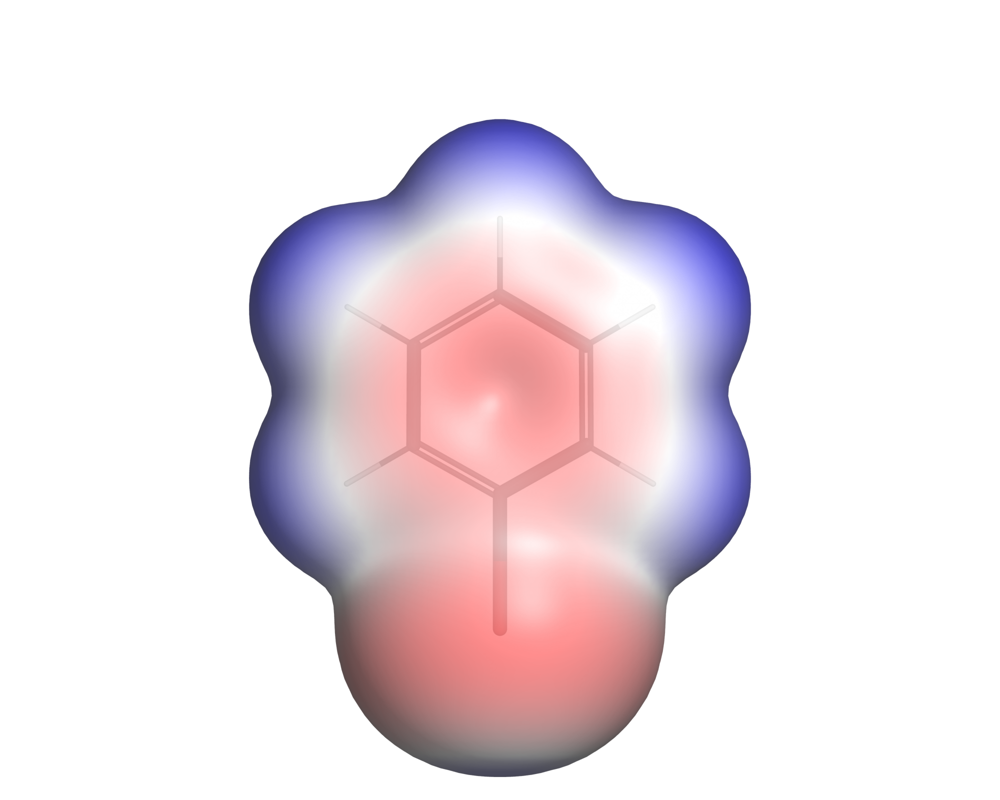
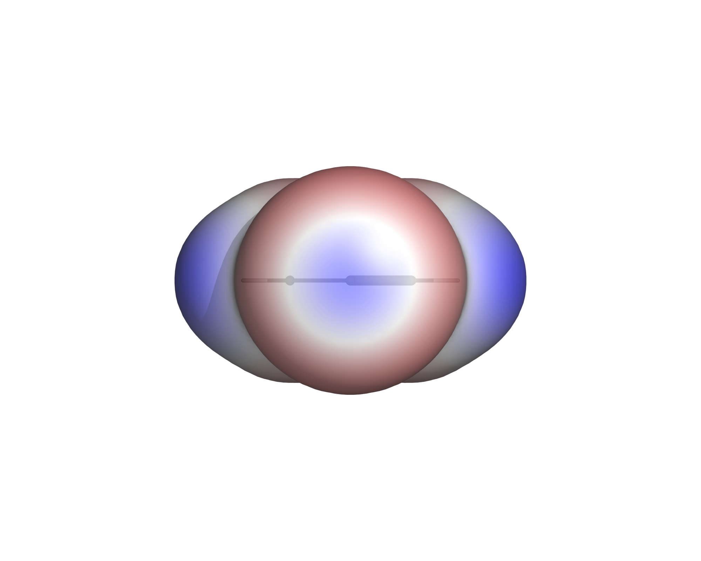
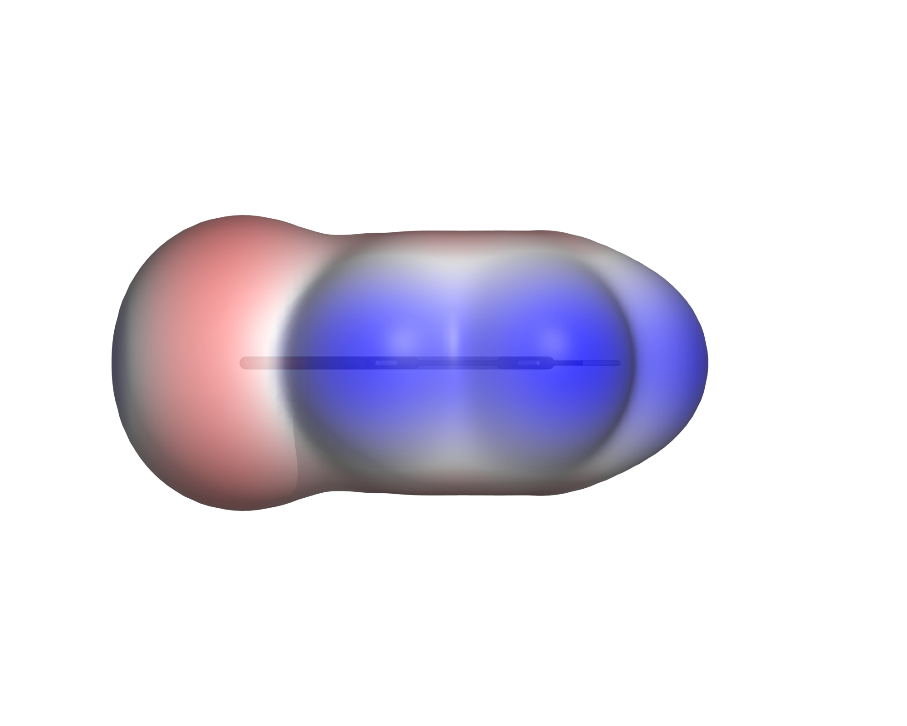
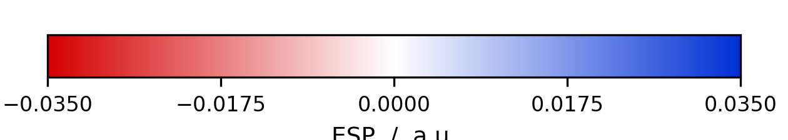

# ESP Visualization

**Standard Operating Procedure — How to Visualize Molecular Electrostatic Potential Data**

A reproducible, scriptable workflow that turns Turbomole `pointval` output into
publication-quality images of the molecular electrostatic potential (ESP) mapped
onto an electron-density isosurface.

| | |
|---|---|
| Input | Turbomole `pointval` grids (`td.xyz`, `tp.xyz`) + a structure file |
| Output | Gaussian cube files, a standard set of PNG images, a CSV of surface ESP statistics |
| Software | Python 3 + NumPy + PyMOL (open source), all free |
| Manual steps | none — the whole pipeline is two commands |

<p align="center">
  
  
  
</p>
<p align="center">
  
</p>

<p align="center"><em>Bromobenzene. Left: π face, negative (red) above the ring.
Centre: view along the C–Br axis — the blue spot inside the red belt is the
σ-hole. Right: in-plane profile.</em></p>

---

## Contents

1. [Why these images look the way they do](#1-why-these-images-look-the-way-they-do)
2. [Software: what was evaluated and what was chosen](#2-software-what-was-evaluated-and-what-was-chosen)
3. [Installation](#3-installation)
4. [Input files and formats](#4-input-files-and-formats)
5. [Step 1 — Convert the grids to cube](#5-step-1--convert-the-grids-to-cube)
6. [Step 2 — Look at it interactively](#6-step-2--look-at-it-interactively)
7. [Step 3 — Render the standard image set](#7-step-3--render-the-standard-image-set)
8. [Step 4 — Several molecules at once](#8-step-4--several-molecules-at-once)
9. [Choosing the colour scale](#9-choosing-the-colour-scale)
10. [Repository layout](#10-repository-layout)
11. [Troubleshooting](#11-troubleshooting)
12. [References](#12-references)

---

## 1. Why these images look the way they do

Two conventions are worth stating up front, because they are what make the
images comparable between molecules and defensible in a report.

**The surface is the ρ = 0.001 a.u. electron-density isosurface**, not a
van-der-Waals surface built from tabulated radii. This is the convention
introduced by Politzer, Murray and co-workers: it encloses roughly 96–97 % of
the electronic charge, it responds to the actual electronic structure of the
particular molecule, and it is defined by a single number rather than by a table
of element radii that different programs disagree about.

**The colour is the ESP on that surface, in atomic units (Hartree/e).** Red is
negative (electron-rich, attracts electrophiles), blue is positive. The scale is
symmetric around zero so that white always means "neutral".

For bromobenzene this pair of conventions makes one specific feature visible:
the **σ-hole**. The potential on the bromine is not isotropic — it is *negative*
in a belt perpendicular to the C–Br bond and *positive* in a cap on the extension
of that bond. That positive cap is what allows a halogen bond, and no single
partial charge on the bromine can represent it. The `_sigma` view exists
specifically to show it.

Measured values for the included example:

| quantity | a.u. | kcal/(mol·e) | kJ/(mol·e) |
|---|---|---|---|
| V<sub>S,min</sub> (π face / Br belt) | −0.0188 | −11.8 | −49.4 |
| V<sub>S,max</sub> (σ-hole) | +0.0315 | +19.8 | +82.8 |

---

## 2. Software: what was evaluated and what was chosen

| Program | Reads cube | Surface + ESP mapping | Colour scale control | Scriptable | Licence |
|---|---|---|---|---|---|
| **PyMOL (open source)** | yes | `isosurface` + `ramp_new` | full, arbitrary ramps | **Python API + `.pml`** | free, open source |
| VMD | yes | Isosurface + Colorvolume | full | Tcl / Python | free, academic |
| UCSF ChimeraX | yes | `surface` + `color electrostatic` | full | command scripts + Python | free, non-commercial |
| Avogadro 2 | yes | yes | limited | limited | free, open source |
| GaussView | yes | yes | limited | **no** | commercial |
| Chemcraft | yes | yes | moderate | **no** | commercial |
| Multiwfn | (generates them) | quantitative analysis | n/a | shell scripting | free |

**PyMOL was chosen** because it is the only candidate that combines all four
requirements of this project: it reads Gaussian cube directly, it maps one volume
onto an isosurface of another, its entire state is reachable from Python — so the
figure settings live in a file under version control rather than in a sequence of
mouse clicks — and it is free and open source, so the SOP can specify the exact
installation as one command instead of a licence request.

GaussView and Chemcraft were ruled out on the automation criterion alone: neither
can be driven from a script, so neither can guarantee that two molecules were
rendered with identical settings.

**Multiwfn** is worth adding to the toolchain later if quantitative surface
descriptors are needed (V<sub>S,min</sub>/V<sub>S,max</sub> statistics, surface
areas, σ-hole magnitudes). This workflow already reports V<sub>S,min</sub> and
V<sub>S,max</sub>, but Multiwfn goes considerably further.

---

## 3. Installation

### 3.1 Prerequisite: a working conda

This workflow needs a **functioning conda installation**. That sounds trivial
and is the single most likely thing to cost you an afternoon, so it is spelled
out here.

If you have no conda yet, install
**[Miniforge](https://conda-forge.org/download/)** — it is free, defaults to the
conda-forge channel that this workflow uses, and is small. During installation:

| Option | Setting |
|---|---|
| Create shortcuts | **yes** — this gives you the "Miniforge Prompt" in the Start menu |
| Add to PATH | **no** — the installer is right, it causes conflicts |
| Register as default Python | **no** — leave any existing Python installation alone |
| Clear package cache | yes |

> **Do not rely on a conda that came bundled with another program.** Several
> chemistry packages (Schrödinger PyMOL among them) ship their own conda inside
> their installation folder. It may be incomplete or broken, it is not intended
> to be used as a general package manager, and — worse — VS Code will happily
> discover it and remember it as "the" conda of the system. You then get
> `conda.exe is not a valid application for this operating system platform` on
> every activation, no matter which interpreter you select. See
> [Troubleshooting](#11-troubleshooting) for how to get out of that.

Verify that conda works *before* going further:

```bash
conda --version
```

On Windows, use the **Miniforge Prompt** from the Start menu. To make conda
available in PowerShell as well, run once:

```bash
conda init powershell
```

then close and reopen every shell.

### 3.2 Create the environment

Keeping it separate from `base` means it can be recreated exactly and nothing
else on the machine is disturbed.

```bash
conda env create -f environment.yml
conda activate esp
```

Or explicitly:

```bash
conda create -n esp -c conda-forge python=3.12 pymol-open-source numpy matplotlib
conda activate esp
```

### 3.3 Verify

```bash
python -c "import pymol, numpy, matplotlib; print('ok')"
python -c "import sys; print(sys.executable)"
```

The second line must point *inside* the `esp` environment. If it points at a
system Python instead, the environment was not activated — see
[Troubleshooting](#11-troubleshooting).

---

## 4. Input files and formats

Per molecule, in one folder:

| File | Content | Units |
|---|---|---|
| `td.xyz` | Turbomole `pointval` **total density** grid | Bohr |
| `tp.xyz` | Turbomole `pointval` **total potential** (ESP) grid | Bohr |
| `*.mol` / `*.sdf` / `*.pdb` / `*.xyz` | molecular structure | Å (default) |

**`td.xyz` and `tp.xyz` are not structure files** despite the extension. They are
ASCII point clouds — one line per grid point, carrying the full coordinates plus
the value:

```
#grid1  start  -15.000000  delta    0.120000  points    251
#electrostatic potential
# cartesian coordinates x,y,z and f(x,y,z)
      -15.00000000   -15.00000000   -15.00000000   -0.00054019
```

At 251³ points that is about 1.25 GB per file. The same information as a
Gaussian cube is roughly 200 MB, because the cube format stores the grid
implicitly.

### Accepted structure formats

Both `xyzToCube.py` and `render_esp.py` accept the same four formats:

| Format | Notes |
|---|---|
| `.xyz` | `Symbol x y z`. With or without the leading atom-count and comment lines — a bare coordinate list is accepted. Unit set by `--struct-unit` (default Å). |
| `.mol` | MDL molfile, V2000 and V3000. **Coordinates come *before* the element symbol**, the reverse of xyz. Always Å. |
| `.sdf` | SD-file; only the first record (up to `$$$$`) is read. Always Å. |
| `.pdb` | `ATOM`/`HETATM` records. Element from columns 77–78, otherwise derived from the atom name. Always Å. |

`--struct-unit` applies to `.xyz` only. Molfile and PDB are in Ångström by
definition, so the option is ignored for them.

**Prefer `.mol`/`.sdf` over `.xyz`**: they carry bond information, so PyMOL draws
proper sticks instead of guessing connectivity from distances.

**Give both scripts the same structure file.** `xyzToCube.py` writes the atom
positions into the cube header, `render_esp.py` hands the structure to PyMOL for
the stick model. If you feed them two different files and those files ever
disagree — a different conformer, a different atom order — the skeleton will sit
offset from its own surface, and **nothing will warn you**. One file for both
removes the failure mode entirely.

---

## 5. Step 1 — Convert the grids to cube

```bash
cd scripts
python xyzToCube.py --struct ../path/to/molecule.mol ../path/to/td.xyz ../path/to/tp.xyz --pymol
```

`--struct` takes `.xyz`, `.mol`, `.sdf` or `.pdb` — see
[§4](#accepted-structure-formats).

This writes `td.cube`, `tp.cube` and (with `--pymol`) a ready-to-use `esp.pml`
next to the input.

Useful options:

| Option | Effect |
|---|---|
| `--stride 2` | keep every 2nd grid point in each direction → **8× smaller** files |
| `--struct-unit bohr` | structure file is already in Bohr |
| `--esp-range 0.035` | colour range written into the generated `esp.pml` |
| `--transparency 0` | opaque surface in the generated `esp.pml` |
| `--outdir DIR` | write the cubes somewhere else |

**On `--stride`.** For bromobenzene, decimating the 251³ grid to 126³ changes
V<sub>S,min</sub> not at all and V<sub>S,max</sub> by 0.9 % (+19.58 vs.
+19.80 kcal/(mol·e)). The rendered images are indistinguishable, the files shrink
from 201 MB to 26 MB and PyMOL becomes noticeably faster. **Recommendation:**
work with `--stride 2` and only regenerate at full resolution for final figures
if you want to. Check this convergence once for a new class of system rather than
assuming it.

What the converter takes care of, which is where hand-rolled conversions usually
go wrong:

* **Index order.** Turbomole varies *x* fastest, the cube format varies *z*
  fastest. Without reordering you get a transposed, mirrored molecule.
* **Units.** The grid is in Bohr, the structure file is normally in Å (factor
  1.8897). Get this wrong and the molecule floats outside its own surface.

---

## 6. Step 2 — Look at it interactively

Before rendering anything, check that structure and grids actually line up:

```bash
pymol esp.pml
```

or, inside a running PyMOL:

```
cd /path/to/molecule
@esp.pml
```

The script loads the structure and both cubes, builds the ρ = 0.001 isosurface,
maps the ESP onto it and shows the colour ramp. Rotate it. The molecular skeleton
should sit inside its surface, not next to it.

Handy while exploring:

```
turn x, 90          # tip into the ring plane
set transparency, 0     # opaque, strongest colours
set transparency, 0.15  # skeleton shows through (default)
disable espramp     # hide the colour bar
```

---

## 7. Step 3 — Render the standard image set

```bash
cd scripts
python render_esp.py --density ../path/td.cube --esp ../path/tp.cube \
                     --struct ../path/molecule.mol --prefix molecule
```

With no arguments it looks for `td.cube`, `tp.cube` and a structure file in the
current directory. Output goes to `images/`.

Three views are produced, oriented **from the molecular geometry**, not from
PyMOL's `orient`:

| File | View | Shows |
|---|---|---|
| `*_pi.png` | perpendicular to the molecular plane | π system, ring hydrogens |
| `*_sigma.png` | along the C–halogen axis, from outside | **the σ-hole, head on** |
| `*_edge.png` | in the molecular plane | overall profile |

The plane normal comes from the principal axes of the heavy atoms; the second
axis is the carbon–halogen bond (or, if there is no halogen, the longest
principal axis). Every molecule therefore lands in the same orientation
automatically — that is what makes the set comparable, and it is why no manual
rotation is needed or wanted.

Alongside the images:

* `*_colorbar.png` — the colour scale as a separate figure (needs matplotlib)
* `*_settings.txt` — every parameter used, including V<sub>S,min</sub> and
  V<sub>S,max</sub>. Keep this next to the figures; it is the record of how they
  were made.

Options worth knowing:

| Option | Default | Effect |
|---|---|---|
| `--esp-range` | `auto` | `auto` or a fixed value in a.u. — see [§9](#9-choosing-the-colour-scale) |
| `--transparency` | `0.15` | `0` = opaque, strongest colours; above ~0.3 the profile views become unreadable |
| `--backgrounds white black` | `white` | render each view on both backgrounds |
| `--views pi sigma` | all three | subset of views |
| `--width / --height / --dpi` | 2000 / 1600 / 300 | image size |
| `--iso` | `0.001` | density isovalue |
| `--buffer` | `2.4` | margin around the molecule, Å |

**Do not use the PyMOL launcher unless you have to.** `python render_esp.py …`
loads no `pymolrc`, so nobody's personal start-up file can silently change a
setting. If you do use the launcher, both the `--` separator and `-k` are
required:

```bash
pymol -ckq render_esp.py -- --prefix molecule
```

---

## 8. Step 4 — Several molecules at once

Put each molecule in its own folder under a common root — for your own data that
is `sandbox/`, which git ignores:

```
sandbox/
├── bromobenzene/   td.xyz  tp.xyz  bromobenzene.mol
├── iodobenzene/    td.xyz  tp.xyz  iodobenzene.mol
└── chlorobenzene/  td.xyz  tp.xyz  chlorobenzene.mol
```

Then:

```bash
cd scripts
python run_all.py --root ../sandbox --stride 2 --two-pass
```

Called **without arguments**, `run_all.py` runs on `reference/` instead. That is
the smoke test: it exercises the whole pipeline on data that is known to work, so
you can tell an installation problem from a data problem before touching your own
files.

```bash
python run_all.py
```

It writes to `reference/*/images_check/` and `reference/summary_check.csv`, never
to the committed `images/` — so you can compare your output against the reference
side by side. Both are git-ignored. Your run should reproduce
V<sub>S,min</sub> = −0.0188 and V<sub>S,max</sub> = +0.0312 a.u. and a colour
range of ±0.035 a.u.

The images will look coarser than the committed ones: the smoke test runs on the
decimated 42³ demo grids, the reference images were rendered at 126³. The
*numbers* are what has to match.

This converts what needs converting, renders every molecule, and writes
`summary.csv` with V<sub>S,min</sub> and V<sub>S,max</sub> for each — in a.u.,
kcal/(mol·e) and kJ/(mol·e).

`--two-pass` first renders every molecule on its own automatic scale, then
re-renders all of them using the largest range it saw, so the final set is
directly comparable. That is the recommended mode for a figure set.

---

## 9. Choosing the colour scale

This is the one decision that cannot be automated away, because it depends on
what the figure is for.

**One molecule, maximum detail** → `--esp-range auto`. The range is derived from
the ESP actually present on the ρ = 0.001 shell and rounded up to a clean value.

**Several molecules to be compared** → one fixed range for all of them.
A red patch in figure A must mean the same potential as a red patch in figure B,
otherwise the comparison is misleading. `--two-pass` does this for you; manually,
run once with `auto`, take the largest reported value and re-run everything with
`--esp-range <value>`.

Whatever you choose, **state the range in the figure caption** and ship
`*_colorbar.png` with the figures. An ESP figure without its scale is
uninterpretable.

For the bromobenzene example the automatic range is **±0.035 a.u.**
(±92 kJ/(mol·e)), stable across both grid resolutions.

---

## 10. Repository layout

```
esp_visualization/
├── README.md                     this document (the SOP)
├── environment.yml               conda environment
├── .gitignore
├── scripts/
│   ├── xyzToCube.py              Turbomole pointval -> Gaussian cube
│   ├── render_esp.py             standard image set from cube files
│   ├── run_all.py                batch driver + summary.csv
│   └── esp.pml                   interactive PyMOL scene
├── reference/                    known-good example — output, not input
│   ├── summary.csv
│   └── brombenzol/
│       ├── brombenzol_aro_opti.mol
│       ├── td_demo.cube          decimated (42³) so it fits in the repo
│       ├── tp_demo.cube
│       ├── images/               reference images (rendered at 126³)
│       └── brombenzol_settings.txt
├── docs/                         exported PDF of this SOP
└── sandbox/                      your own data and experiments, not tracked
```

**`reference/` and `sandbox/` do different jobs.** `reference/` holds a
known-good example: the images this workflow is supposed to produce, the
parameters that produced them, and a small decimated dataset to reproduce them
with. It is committed, and you do not edit it. `sandbox/` is where your own
molecules and the large raw data live; git ignores it entirely. If a run goes
wrong, `reference/` tells you whether the problem is your installation or your
data.

**Large files are deliberately not tracked.** `.gitignore` excludes `*.cube`
and the Turbomole `td.xyz`/`tp.xyz` grids — a full-resolution cube is 201 MB and
GitHub rejects anything above 100 MB. Regenerate them from the raw data with
`xyzToCube.py`.

The two `*_demo.cube` files are an exception: decimated to 42³ (~1 MB each) so
that a fresh clone can be tested immediately:

```bash
cd scripts
python render_esp.py --density ../reference/brombenzol/td_demo.cube \
                     --esp ../reference/brombenzol/tp_demo.cube \
                     --struct ../reference/brombenzol/brombenzol_aro_opti.mol \
                     --prefix demo --outdir /tmp/demo
```

The images in `reference/brombenzol/images/` were rendered from the finer 126³
grid, so they are smoother than what the demo cubes produce. Both give the same
±0.035 a.u. colour range.

Use `sandbox/` for experiments and large data; it is ignored by git, so the
scripts in `scripts/` stay the single source of truth. Do not keep a second copy
of the scripts elsewhere — that is exactly how two versions drift apart.

---

## 11. Troubleshooting

**`ContourSurfVolume: VTKm not available, falling back to internal implementation`**
Harmless, and it appears on every run. VTK-m is an optional parallel contouring
backend that the conda-forge PyMOL build is not compiled with. PyMOL uses its
built-in marching-tetrahedra routine instead; same isosurface, slightly slower.
Nothing to fix.

**The script runs under `pymol -cq` but nothing happens, no error.**
The `--` separator is missing, so PyMOL swallowed the arguments. Use
`pymol -ckq render_esp.py -- --prefix molecule`, or simply
`python render_esp.py --prefix molecule`.

**The molecule floats next to its surface instead of inside it.**
Unit mismatch. The grid is in Bohr, the structure file is probably in Å. Check
the `--struct-unit` setting.

**The molecule looks mirrored or transposed.**
Grid index order. Turbomole varies *x* fastest, cube varies *z* fastest.
`xyzToCube.py` handles this; a hand-written converter usually does not.

**The molecule is tiny in the middle of a large empty image.**
Something zoomed on the isosurface object. A PyMOL isosurface carries the extent
of the *entire grid box*, not of the visible surface. Zoom on the molecule
object instead.

**Colours look washed out, or the profile view is unreadable.**
Transparency too high. Above ~0.3 you are looking through the whole molecule and
seeing the far side's colours mixed in. Use `0.15`, or `0` for maximum contrast.

**No `*_colorbar.png` was produced.**
matplotlib is missing in the active environment: `conda install -c conda-forge
matplotlib`. The molecule images are unaffected — matplotlib only draws the
scale bar.

**`conda: command not found` in `cmd.exe` although it works in VS Code.**
Conda is installed but not on the system PATH; VS Code activates it explicitly.
Run `conda init powershell` (or `conda init cmd.exe`) once from a shell where
conda *does* work — on Windows, the Miniforge Prompt.

**`conda.exe is not a valid application for this operating system platform`.**
The conda being invoked is a broken one bundled with another program. Find out
which one is configured:

```powershell
$env:CONDA_EXE
```

If that prints a path inside some application's folder rather than your
Miniforge installation, that is the culprit. It can come from three places —
check them in this order:

1. **A stale PowerShell profile.** `Test-Path $PROFILE`; if `True`, open it with
   `notepad $PROFILE` and delete the block referring to the foreign conda.
2. **A permanent environment variable.**
   `[Environment]::GetEnvironmentVariable("CONDA_EXE","User")` — clear it with
   `[Environment]::SetEnvironmentVariable("CONDA_EXE",$null,"User")`.
3. **VS Code.** If the variable is set *only* inside the VS Code terminal and
   nowhere else, the Python extension is responsible. Open user settings
   (`Ctrl+Shift+P` → "Preferences: Open User Settings (JSON)") and point it at
   the right conda:

   ```json
   "python.condaPath": "C:\\Users\\<you>\\miniforge3\\Scripts\\conda.exe"
   ```

   Then check `.vscode/settings.json` in the repository for a stale
   `condaPath` or `defaultInterpreterPath`, and reload the window.

Note that selecting the right interpreter is **not** sufficient: the interpreter
decides *which* environment is activated, `CONDA_EXE` decides *what does the
activating*.

**The VS Code terminal uses the wrong Python.**
`python -c "import sys; print(sys.executable)"` shows a system Python instead of
the environment. Select the interpreter explicitly: `Ctrl+Shift+P` → "Python:
Select Interpreter" → **"Enter interpreter path…"** → the full path to
`envs/esp/python.exe`. Do not pick from the list if it still contains stale
entries. Then close *all* terminals and open a new one.

As a fallback that depends on no shell configuration at all, call the
environment's interpreter directly:

```powershell
& "C:\Users\<you>\miniforge3\envs\esp\python.exe" render_esp.py --prefix molecule
```

**`Unbekanntes Element 0.0000` / `Unknown element 0.0000` from `xyzToCube.py`.**
Fixed — the script now detects molfiles. If you see this on an older copy, the
structure file is an MDL molfile being parsed as xyz: molfiles list the
coordinates before the element symbol.

**Transparent surfaces show artefacts where atoms overlap.**
`set transparency_mode, 2` — without it PyMOL sorts transparent faces
incorrectly. The provided scripts set this already.

---

## 12. References

**Method / convention**

* F. A. Bulat, A. Toro-Labbé, T. Brinck, J. S. Murray, P. Politzer,
  *Quantitative analysis of molecular surfaces: areas, volumes, electrostatic
  potentials and average local ionization energies*,
  J. Mol. Model. **16** (2010) 1679–1691. [doi:10.1007/s00894-010-0692-x](https://doi.org/10.1007/s00894-010-0692-x)
* J. S. Murray, P. Politzer, *The electrostatic potential: an overview*,
  WIREs Comput. Mol. Sci. **1** (2011) 153–163. [doi:10.1002/wcms.19](https://doi.org/10.1002/wcms.19)

**Software**

* PyMOL — The PyMOL Molecular Graphics System, Schrödinger, LLC.
  Open-source build: <https://github.com/schrodinger/pymol-open-source>
* W. Humphrey, A. Dalke, K. Schulten, *VMD — Visual Molecular Dynamics*,
  J. Mol. Graph. **14** (1996) 33–38. [doi:10.1016/0263-7855(96)00018-5](https://doi.org/10.1016/0263-7855(96)00018-5)
* E. C. Meng et al., *UCSF ChimeraX: Tools for structure building and analysis*,
  Protein Sci. **32** (2023) e4792. [doi:10.1002/pro.4792](https://doi.org/10.1002/pro.4792)
* T. Lu, F. Chen, *Multiwfn: A multifunctional wavefunction analyzer*,
  J. Comput. Chem. **33** (2012) 580–592. [doi:10.1002/jcc.22885](https://doi.org/10.1002/jcc.22885)
* T. Lu, *A comprehensive electron wavefunction analysis toolbox for chemists,
  Multiwfn*, J. Chem. Phys. **161** (2024) 082503. [doi:10.1063/5.0216272](https://doi.org/10.1063/5.0216272)
* M. D. Hanwell et al., *Avogadro: an advanced semantic chemical editor,
  visualization, and analysis platform*, J. Cheminform. **4** (2012) 17.
  [doi:10.1186/1758-2946-4-17](https://doi.org/10.1186/1758-2946-4-17)
* G. Schaftenaar, J. H. Noordik, *Molden: a pre- and post-processing program for
  molecular and electronic structures*, J. Comput.-Aided Mol. Des. **14** (2000)
  123–134. [doi:10.1023/A:1008193805436](https://doi.org/10.1023/A:1008193805436)

---

*Practical Bioinformatics Project — Visualization of Molecular Electrostatic
Potentials.*
